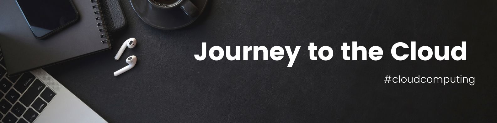

# Cloud Transformation

  

  

## The Journey
1. Revisit the Cloud Basics :speech_balloon:
2. Come up with the learning plan :dash:
3. Make a point to stick to the plan and make wellness a point too :curry:
4. Upload the content here on daily basis :notes:
5. Be presentation ready on your content :thumbsup:
6. Live in the glory of the learned brain :sparkles:
7. Now that you have learned cloud, take a break, go for an outing...:checkered_flag: :moyai:  

** To Pursue Cloud Computing Mastery path, one should have 4-7 years of hands-on experience on the DevOps, Microservices, Security, and Full Stack Architecture Design Patterns. I would recommend you to revisit few IT related courses preferably around IT networking and Linux fundamentals for in-depth knowledge in these areas before venturing on the Cloud. To be frank, it depends on the experience level and your interest in the Cloud to come up with flying colors in this area. For the starters, take a cloud practitioner/essentials course exam and gets hands-on on cloud, it would take 6 months and anybody can take it whether you are 18 yrs. old or 40 yrs. old, it doesn't matter, just hop on to your cloud express :bullettrain_front:. Just make sure that you don't mug up things for a while but it should be pragmatic exprerience as well. And, if you're planning for masters, select your masters' programme as per your interest and continue on technical area side by side:vertical_traffic_light:. For more, you can keep my YouTube Playlist below as a reference, I keep on updating these as per industry requirements  

1. Introduction to DevOps Tools: https://lms.simplilearn.com/courses/4305/Introduction-to-Devops-Tools  
2. Development Library :	https://bit.ly/3K92GXO  
3. Digital Product Library :	https://bit.ly/3pAquKA  

Further, Google launched beginner library on Coursera, if required, please go through these basic courses to refresh/upscale on product development and management for DevOps work. However, if you're from other applied areas, you might need to come up with different learning library  
1. Google UX Design: https://www.coursera.org/professional-certificates/google-ux-design  
2. Google IT Support: https://www.coursera.org/professional-certificates/google-it-support  
3. Google Data Analytics: https://www.coursera.org/professional-certificates/google-data-analytics  
4. Google Digital Marketing Ecommerce: https://www.coursera.org/professional-certificates/google-digital-marketing-ecommerce  
5. Google Project Management: https://www.coursera.org/professional-certificates/google-project-management  

  

## Stepping out the door, publishing my cloud memoir

- [ ] 20 AUG 2022 > Playing with the Canva to come up with the banner online. Created my learning accounts on AWS and Azure. Referred https://gist.github.com/rxaviers/7360908 for README.md    
- [ ] 21 AUG 2022 > Came up with my learning plan and it's brutal, need to plan for wellness as well, I'm thinking 1-2 hours per day.  
- [ ] 22 AUG 2022 > Started on Cloud Practioner Essentials Week 1, tide is high and I'm sailing on for sure 😉  
- [ ] 23 AUG 2022 > Revisited few basics on the S3 Bucket, EC2, Route 53, and Load Balancing    
- [ ] 24 AUG 2022 > No Revision  
- [ ] 25 AUG 2022 > Introduction to Docker and Kubernetes  
- [ ] 26 AUG 2022 > Contd.    
- [ ] 27 AUG 2022 > Contd.   
- [ ] 28 AUG 2022 > Revisted the Learning plan and tweaked for quick results     
- [ ] 29 AUG 2022 > AWS Containerization and EKS   
- [ ] 30 AUG 2022 > AWS Cloud Practitioner Essentials    
- [ ] 31 AUG 2022 > AWS Cloud Practitioner Essentials Week 3 made me cackle after a long S3 classification, I was about to doze off but now, I feel alright ...        

## Walking down the road

- [ ] 1 SEP 2022 > AWS Cloud Practitioner Essentials...   
- [ ] 2 SEP 2022 > Browsing around on YouTube for the cloud training for ideas  
- [ ] 3 SEP 2022 > Took a day off as I had guests in my home   
- [ ] 4 SEP 2022 > Had a good meal on Sunday and completed pending courses in Marketing  
- [ ] 5 SEP 2022 > Completed AWS Cloud Practioner Essentials course, ready to take exam   
- [ ] 6 SEP 2022 > Revision and hands on AWS cloud     
- [ ] 7 SEP 2022 > Exam Prep for AWS Cloud Practitioner    
- [ ] 8 SEP 2022 > BIRTHDAY today :birthday:, taking off  
- [ ] 9 SEP 2022 > AWS Exam Prep  
- [ ] 10 SEP 2022 > Met a friend    
- [ ] 11 SEP 2022 > Attended Webinar and revisited few areas around Cloud  
  
## Crossing the bridge

- [ ] 12 SEP 2022 > Attended Exam prep by AWS and took Mock tests, subscribed more webinars on my Calendar around cloud  
- [ ] 13 SEP 2022 > So, in the next few days, I'm going to put myself in motion so that I enjoy cloud ride along with my work. For this, I'm going through few Bootcamps on Udemy, Practice tests, and Exam Prep readiness material everyday since naming conventions are different in every cloud (AWS, Azure, GCP) but I'm taking AWS first. And, I have to read blogs, docs, news, and new features around it as well.
- [ ] 14 SEP 2022 > Going through few topics on Cloud again, from the next month onwards, my classes would start and I am going to post my activity seldom here   
- [ ] 15 SEP 2022 > Took it slow today  
- [ ] 16 SEP 2022 > Found a good DevOps Library, auditing today https://lms.simplilearn.com/courses/4305/Introduction-to-Devops-Tools  
- [ ] 21 SEP 2022 > Embarking on the Journey, induction session on my Great Learning course  
- [ ] 22 SEP 2022 > Got myself registerd for many AWS Events https://go.aws/3dtUoxX. Please do checkout. It can be different as per your location and partner profile.    
- [ ] 23 SEP 2022 > Attended AWS Cloud Practitioner Event https://classnotes.puser.info/CPELinks_v3.html and checked in file in the Content folder  
- [ ] 26 SEP 2022 > Calendar full of AWS Events is all I wanted to put myself on Cloud 9  
- [ ] 29 SEP 2022 > Finished a few courses on https://explore.skillbuilder.aws/ and enrolled myself on Associate track  
- [ ] 30 SEP 2022 > After first 40 days of arranging courses, webinars, websites, materials, and events on the cloud, I am feeling confident that I can start with my deeper level of understanding now   
- [ ] 02 OCT 2022 > Found a link to GCP Interactive Cheat sheet https://googlecloudcheatsheet.withgoogle.com/  
- [ ] 07 OCT 2022 > Attended three days workshop on AWS QuickSight https://bit.ly/3SMGeqV  
- [ ] 10 OCT 2022 > For my record here, I am attending events this month from other cloud providers for my work, will be updating on AWS Cloud Practitioner soon ...  
- [ ] 11 OCT 2022 > AWS Power-hour links https://bit.ly/3fUCHIy , https://go.aws/3TbF5Ju, && https://bit.ly/3fUCHIy  
- [ ] 18 OCT 2022 > Busy with the Partner events from past few weeks, gonna update my progress on the Cloud Exam soon ...  
- [ ] 20 OCT 2022 > After being enticed by Cloud right from the beginning, I was so hesitant when I started with the AWS in the month of August, but it felt like Computer Science with different nomenclature, so, I continued. Although, I have experience in every area of IT and Development but still, Cloud is a Cloud. Phew! I feel alright now ... FOMO can become real sometimes... Next, Azure & GCP, will update in the next year. Today, I got a link to AWS Resources https://resources.awscloud.com/   
- [ ] 29 OCT 2022 > Still attending training from AWS on components...Well, it may differ from person to person but as an architect brain, I like to study everything in one go. However, I was busy in too many training, hence, I could not study for certfication in the last month, I'll take it the coming months. As of now, I'm entering into the lab assignments phase which would take another month to hands-on on components    
- [ ] 9 NOV 2022 > Still in training mode, but I learned about partner compentency program https://aws.amazon.com/partners/programs/competencies/  

## Into the bushy, thorny forest

- [ ] 16 NOV 2022 > Last month, I revisited Cybersecurity theoretical concepts from OWASP, CompTIA, CISSP, ITIL, and InfoSec to understand security layer and compliances associated with the Cloud. Not a very good strategy, but I had to brush up on everything quickly to start with the lab session in the AWS training. One can definitely skip this step for the last, but I would recommend to revisit basics of Cybersecurity and pen testing for work  
- [ ] 21 NOV 2022 > Submitted my first assignment in Cloud Computing program... Since August 20th, I am going through all cloud offerings online, and I chose to start with the AWS first. Seriously, even after having experience in the industry, at 12 years of experience, I conclude, AWS or Azure or GCP, you cannot do it in weeks, you need to start at one service and keep connecting services on cloud. Though, my area is difficult because it starts with EC2 and S3, go to containerization to EKS along with security factor. However, I am mainly working Data strategy and management which opens up plethora of services and code pipeline on AWS. I'm advised to take it slow, otherwise, I will be exhausted with office work. I kind of drew a similar conclusion in case of hands-on work on the cloud. You cannot do it in a day, so, I'm taking small steps after completing basics, EC2, Storage Options, and WAF. Harder part starts now    
- [ ] 22 NOV 2022 > AWS Cloud is not just a Cloud deployment or for migration. Post migration, we can actually do a lot in the data analytics and machine learning area as well. Since I have a decent experience in development area, I want to take it further to the next level. In few months, I will be done with the basics. So, I'm picking AWS SageMaker and Tensorflow to evaluate few services offered by AWS as I liked their training on Data Analytics.  
- [ ] 27 NOV 2022 > Still going through the AWS services, however, starting with Containers on AWS for this month as my assignment is due at the end of December. Holiday season is ON for me, I have no idea how would I study in the cold winter season again, but let's see, maybe coffee, green tea, and hot chocolate will help along with Xmas playlist on YouTube. Wrong choices, but I don't want to miss the Xmas vibe of this year because of my academic routine.  
- [ ] 28 NOV 2022 > I furthered my security concepts from CISA, CISM, CRISC, NIST, OWASP, and CISSP again, but I completely detested myself for not watching FIFA matches. Information workload is real, I think, at this point when innovation management is becoming real, anybody who is in their early 30s and getting the assignment of technology management in any area might be feeling confused as it is too much work to understand in one go. Basics covered, time to move on to the next level.  

## Trekking the dunes

- [ ] 6 DEC 2022 > Completed my CBAP training with assessment yesterday. Woohoo! This one is done now. I needed to revise the basics to understand the Enterprise Architecture in the business transformation, though you'll be hearing a different view on CBAP as TOGAF is the one but to study TOGAF, COBIT, ITIL, and other Enterprise Architecture Governance guideleines, CBAP will provide the good foundation. Even if you are experienced, I would recommed 5 years of continuous learning here to begin with Enterprise Architectures. Although, if you do CBAP and PMP, you are good to go at your job in the workplace. We don't need to dig in deep as they might not be your areas, but just general awareness if you do not practice them. However, for me, I required them as I continued studying Enterprise Architectures since bachelors and worked on few as Developer/Lead. Though I studied E-Business before along with consulting tools and technqiues but taking exams is not like everyday activity, I'd to dedicate a lot of time and effort to pass  the assessment without revising the BaboK post training lessons. Finally, from this month onwards, I will be working on Containers on AWS and will be taing MooC soon on it as well. Though the test will be on the easier side, but I am hoping to start on Containers ASAP as this is directly related to my work in code refactoring.  
- [ ] 9 DEC 2022 > Well, micro and macro setting always makes me go all over the places to see how the solutions are actually implemented using newer Saas products in the market. I wouldn't say I don't work on IaaS and PaaS but I come from product development, I mainly work on configuration on container using Git, DevOps tools, Java, and Databases. Though, I'm really looking forward to automation but that's not possible either. So, you see, a lot of integration happens in the product development which consumes like of energy initially. It's like economies of scale definitely. Coming back to the Container on AWS topic, I will be starting with pipeline today, let's see how it goes.   
- [ ] 10 DEC 2022 > Started with Containers from <a href="https://www.coursera.org/learn/cloud-virtualization-containers-api-duke?specialization=building-cloud-computing-solutions-at-scale" target="blank">Cloud Virtualization, Containers and APIs</a> along with my Post Graduate Program at Great Lakes which is also running Containers on Cloud all month.  
- [ ] 12 DEC 2022 > Revising few DevOps areas again to follw up with the micro areas for Containers changes. Next App Modernization https://aws.amazon.com/blogs/enterprise-strategy/6-strategies-for-migrating-applications-to-the-cloud/   
- [ ] 21 DEC 2022 > Delayed few things as I have to wrap this year as quickly as I can as I was committed to a massive learning goal this year, some areas were refresher while others really took toll on my sleeping patterns all year, but what to do though government/institution(s) tries to teach you mostly in bachelors and masters, but disruption gets real. So, sometimes, you have to become extra vigilant to these changing patterns & paradigm shifts and make a point to follow-through through updates in your niche, hence, I did...    
- [ ] 24 DEC 2022 > Watched two movies on the Christmas eve, The Addams Family & Ram Setu   
- [ ] 25 DEC 2022 > Started on my assignment, two case studies, Containers on AWS and Lululemon Atheletica, have to submit in two days.  
- [ ] 02 JAN 2023 > In the past 8 days, I submitted my assignment on Containers on AWS, then post-submission, I had good four days rest without any heavy reading material. So, I focused on planning ahead for the year 2023, spent few hours watching Christmas flicks as I was busy on Christmas with my pending tasks, then I wanted to finish them before we enter into 2023. HAPPY NEW YEAR :tada:!  
- [ ] 10 JAN 2023 > Started with AWS Services now... Couple of months ago, I didn't want to look at the cloud interface with work, now, it feels why did that even  happen? I hope it's fluidic now, now, I will not hate the ugliness in switching platforms while working. Sometimes, meditation helps in compartmentalizing the tasks in your brain or we can say repetition helps in hardwiring. I'll update on the Services links post this month.  
- [ ] 18 JAN 2023 > Attended Migration Business Case Development again to assess report on https://accelerate.amazonaws.com/  

## Winding through the canyons

## Stumbling through the caves

## Resting at the Lagoon

## Up into the mountains

## Into the sky to touch the cloud!

  

## Reference Material :books:  
  
1.	Tools & Technologies studied so far:  https://bit.ly/3Dj9zEF     
2.	PG Program in Business Analysis: https://bit.ly/3SJ1T2I
3.	PG Program in Cloud Computing: https://bit.ly/3T8Qf2b    
4.	Cloud Computing by Duke: https: https://www.coursera.org/learn/cloud-computing-foundations-duke/lecture/zNF7x/instructor-introduction    
5.	Become a DevOps Engineer: https://www.linkedin.com/learning/paths/become-a-devops-engineer    
6.	AWS Docs : https://docs.aws.amazon.com/    
7.	Developer to Architect: https://www.udemy.com/course/developer-to-architect/    
8.	AWS Fundamentals: https://www.coursera.org/specializations/aws-fundamentals    
9.	AWS Cloud Practitioner Essentials : https://www.coursera.org/learn/aws-cloud-practitioner-essentials    
10.	DevOps on AWS Specialization: https://www.coursera.org/specializations/aws-devops    
11.	Running Jenkins on AWS: https://www.linkedin.com/learning/running-jenkins-on-aws-8591136/running-jenkins-on-aws/    
12.	Containerized application on AWS: https://www.coursera.org/learn/containerized-applications-on-aws    
13.	Exam Prep by AWS: https://www.coursera.org/learn/exam-prep-aws-sysops-administrator    
14.	Exam Prep: AWS Certified Cloud Practitioner Foundations : https://www.coursera.org/learn/cloud-practitioner-exam-prep    
15.	Exam Prep: AWS Certified Solutions Architect - Associate : https://www.coursera.org/learn/aws-certified-solutions-architect-associate    
16.	AWS Certified Cloud Practitioner: https://www.udemy.com/course/aws-certified-cloud-practitioner-new    
17.	Building Modern application with Java: https://www.coursera.org/learn/building-modern-java-applications-on-aws/lecture/7QKLj/introduction-to-building-modern-applications    
18.	Azure Learning: https://bit.ly/3pySkqF    
19.	Prepare for the Designing and Implementing Microsoft DevOps Solutions (AZ-400) Exam : https://www.linkedin.com/learning/paths/prepare-for-the-designing-and-implementing-microsoft-devops-solutions-az-400-exam    
20.	GitHub AZ400 Library: https://github.com/MicrosoftLearning/AZ400-DesigningandImplementingMicrosoftDevOpsSolutions    
21.	Azure Docs: https://docs.microsoft.com/en-us/azure/devops/pipelines/?view=azure-devops    
22.	Azure Developer Space: https://azure.microsoft.com/en-us/products/devops/?nav=min#overview  
23.	AZ 400 Training: https://query.prod.cms.rt.microsoft.com/cms/api/am/binary/RE3VP8d    
24.	Learning NGINX: https://www.linkedin.com/learning/learning-nginx/what-is-nginx/    
25.	Learning UML: https://bit.ly/3ABBApe    
26.	Learning UML: https://bit.ly/3A9AGyE    
27.	BPMN 2.0: https://www.udemy.com/course/process-mapping-process-flowcharts/    
28.	Business Transformation Google Cloud: https://www.coursera.org/learn/business-transformation-google-cloud/    
29.	Digital Transformation Google Cloud: https://www.coursera.org/learn/digital-transformation-google-cloud/    
30.	Developing Apps GCP: https://www.coursera.org/specializations/developing-apps-gcp    
31.	Google Cloud Operations for GKE: https://www.coursera.org/projects/googlecloud-cloud-operations-for-gke-hhhly    
32.	Data to Insights GCP: https://www.coursera.org/specializations/from-data-to-insights-google-cloud-platform    
33.	Adopting GCP: https://www.coursera.org/specializations/organizational-change-and-culture-for-adopting-google-cloud    
34.	GCP Digital Leader Training: https://www.coursera.org/professional-certificates/google-cloud-digital-leader-training    
35.	GCP DevOps Engineer: https://www.coursera.org/professional-certificates/sre-devops-engineer-google-cloud    
36.	GCP Cloud Architect: https://www.coursera.org/professional-certificates/gcp-cloud-architect    
37.	DCA Certification: https://www.linkedin.com/learning/paths/prepare-for-the-docker-certified-associate-dca-certification/    
38.	Cloud Computing at Scale: https://www.coursera.org/specializations/building-cloud-computing-solutions-at-scale    
39.	Certified Kubernetes Administrator: https://share.percipio.com/cd/eht-evrza  
40.	Running Kubernetes on EKS: https://www.linkedin.com/learning/running-kubernetes-on-aws-eks/selecting-worker-sizing?autoSkip=true&autoplay=true&resume=false    
41.	Master Cloud Native Infrastructure with Kubernetes: https://www.linkedin.com/learning/paths/master-cloud-native-infrastructure-with-kubernetes     
42. Software Architecture for IOT: https://www.coursera.org/learn/iot-software-architecture/  
43. Enterprise and Infrastructure Security: https://www.coursera.org/learn/enterprise-infrastructure-security/   
44. Digital Governance: https://www.coursera.org/learn/digitalgovernance  
 

